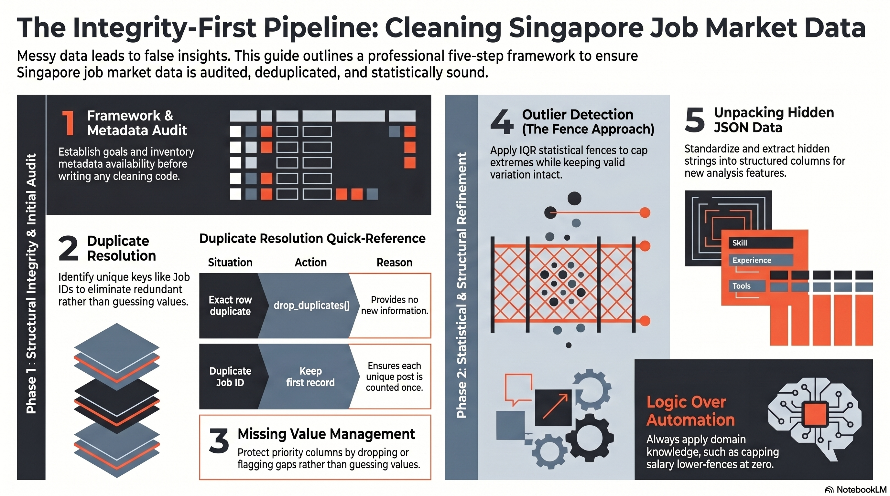

# 📊 Singapore Job Market: Data Cleaning Guide

Welcome! This repository provides a beginner-friendly guide to data cleaning using real-world job market data from Singapore. In data analysis, we follow the principle of **"Garbage In, Garbage Out"**—if your data is messy, your insights will be wrong. This guide ensures your analysis is built on a clean, reliable foundation.

## 📖 Table of Contents
1. [The Analytical Framework](#1-the-analytical-framework)
2. [Handling Duplicates](#2-handling-duplicates)
3. [Managing Missing Values](#3-managing-missing-values)
4. [Outlier Detection & Treatment](#4-outlier-detection--treatment)
5. [Unpacking Hidden Data](#5-addressing-hidden-data-unpacking-json)
6. [Final Summary Checklist](#6-final-summary-checklist)

---

## 1. The Analytical Framework
Before writing any code, a professional analyst follows a three-step framework to ensure they aren't wasting time on irrelevant data.

* **Step A: Define the Problem Statement:** Identify the business or policy goal, such as identifying salary benchmarks for Junior vs. Executive roles.
* **Step B: Identify Key Questions:** Determine what specific questions the data must answer, such as the median salary for different sectors.
* **Step C: Audit Metadata & Availability:** Check your "inventory" to see if data is **Available** (ready for use), **Available but Hidden** (requires transformation), or **Not Available** (completely missing).

---

## 2. Handling Duplicates
Duplicates can occur due to technical glitches or companies reposting the same role multiple times. They can distort your analysis by providing redundant information.

| Situation | Action | Why? |
| :--- | :--- | :--- |
| **Exact row duplicate** | `drop_duplicates()` | Provides no new information. |
| **Duplicate Job ID** | Keep the first record | Ensures each unique job post is only counted once. |

---

## 3. Managing Missing Values
We use an **"Integrity-First"** approach. If a **Priority Column** (critical information like `average_salary`) is missing, guessing can contaminate your results.

* **Drop Column:** Use when more than 50% of the data is missing and the column is not essential (e.g., `occupationId`).
* **Drop Row:** Use when a critical piece of information is missing in only a few records.
* **Impute (Median/Mode):** Only use when missingness is very low (<5%). Median is safer than mean as it is resistant to extreme outliers.
* **Flag as "Unknown":** Labeling missing entries (e.g., in `categories`) as "Uncategorized" is more transparent than guessing.

---

## 4. Outlier Detection & Treatment
An outlier is a data point that differs significantly from others, such as a CEO's salary in a junior-level dataset.

### The IQR Method (The "Fence" Approach)
We use the **Interquartile Range (IQR)** to build statistical safety fences:
* **Lower Fence:** Q1 - 1.5 * IQR (In salary data, we cap this at **0** as salaries cannot be negative).
* **Upper Fence:** Q3 + 1.5 * IQR.

### Treatment Strategies
1.  **IQR Filtering (Delete):** Best if the outlier is likely a data entry error, like an extra zero.
2.  **Clipping (The "Cap"):** Force extreme values to stay within the range (asking them to "duck"). This keeps the record intact while preventing distortion.
3.  **Keep as is:** Best when the outlier reflects real-world variation, such as a niche high-paying tech role.

---

## 5. Addressing "Hidden" Data: Unpacking JSON
To make JSON data usable for analysis, we must unpack it.

### The General Approach to Unpacking:
Instead of treating the column as plain text, we apply a transformation process that follows these logic steps:

1.  **Standardize Format:** We replace inconsistent quotes (e.g., changing single quotes to double quotes) to ensure the text strictly follows JSON standards.
2.  **Safe Extraction:** We attempt to "load" the string into a structured list or dictionary format. If the string is empty or malformed, we assign a default label like **"Uncategorized"** to prevent the analysis from crashing.
3.  **Target the Data:** We isolate the specific "category" key within the first item of the list.
4.  **Create New Features:** We save this extracted value into a new column, like `primary_category`, which allows us to unlock insights into job mark

---

## 6. Final Summary Checklist
* [ ] **Identify Unique Keys:** Use IDs (like `metadata_jobPostId`) rather than just checking for exact row duplicates.
* [ ] **Protect Data Integrity:** Define Priority Columns and avoid imputation whenever possible.
* [ ] **Visualize First:** Always understand your distribution before applying rules.
* [ ] **Logic Check:** Apply domain knowledge (e.g., salaries cannot be negative) to your statistical formulas.

Please refer to [data_cleaning_guide.ipynb](data_cleaning_guide.ipynb) for a stylised example.
